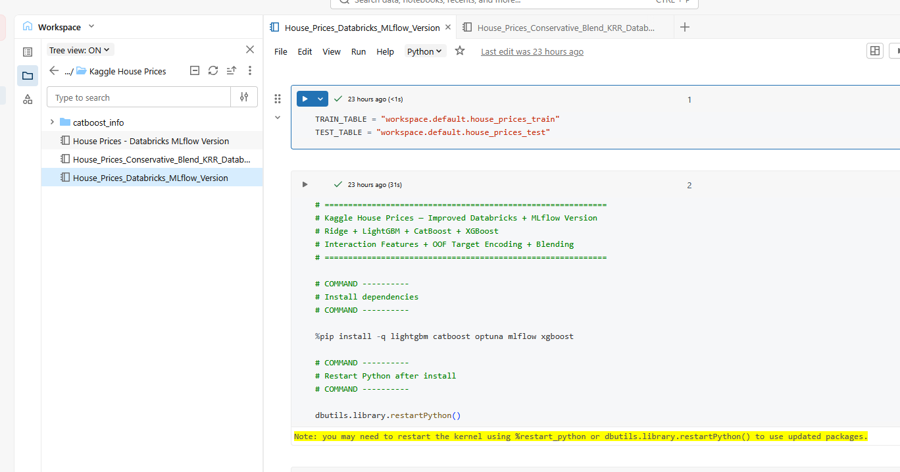
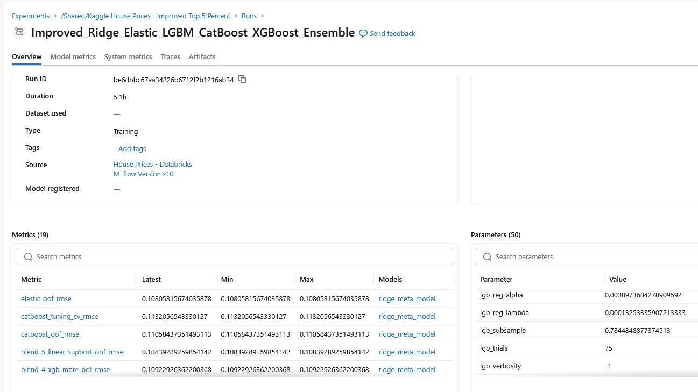
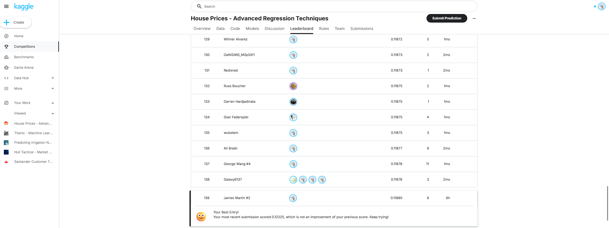

# Kaggle House Prices — Top 3% Regression Solution with Databricks + MLflow

Achieved a **Top 3% score** on a Kaggle-style House Prices regression assignment by building an end-to-end machine learning pipeline for residential sale price prediction.

Final improved public leaderboard RMSE: **0.11880**

The final selected submission came from the conservative weighted blend output:

```text
submission_blend_databricks_mlflow.csv
```

This repository includes both the original competition-style modeling workflow and a Databricks + MLflow version that demonstrates a more production-oriented machine learning process.

## Project Highlights

- **Result:** Top 3%
- **Final Kaggle RMSE:** 0.11880
- **Final Submission File:** `submission_blend_databricks_mlflow.csv`
- **Best Public Model:** Conservative weighted blend
- **Stacked Ensemble RMSE:** 0.12096
- **Task:** Predict residential home sale prices
- **Metric:** Root Mean Squared Error
- **Models Used:** Ridge Regression, ElasticNet, LightGBM, CatBoost, XGBoost
- **Techniques:** Feature engineering, interaction features, leakage-safe target encoding, log-target transformation, cross-validation, Optuna tuning, out-of-fold prediction, weighted blending, multi-seed averaging
- **Platform:** Databricks
- **Experiment Tracking:** MLflow

## Project Overview

The goal of this project was to predict residential home sale prices using structured housing data.

The dataset includes many property-level predictors, including dwelling type, zoning classification, lot frontage, lot area, neighborhood, overall material and finish quality, basement variables, garage variables, living area, sale type, and sale condition.

The modeling pipeline includes:

1. Data loading from Databricks tables
2. Missing value handling
3. Data type correction for Databricks-uploaded CSV tables
4. Known train-only outlier removal
5. Feature engineering
6. Interaction feature creation
7. Ordinal and categorical feature processing
8. Leakage-safe target encoding
9. Log transformation of `SalePrice`
10. Cross-validation using RMSE
11. Hyperparameter tuning with Optuna
12. Model training with Ridge, ElasticNet, LightGBM, CatBoost, and XGBoost
13. Out-of-fold prediction generation
14. Stacked ensemble testing
15. Conservative weighted blending
16. Submission generation
17. MLflow experiment tracking in Databricks

## Model Development

The first version of the project used Ridge Regression, LightGBM, and CatBoost with stacking and achieved a strong baseline score.

The improved version added:

- ElasticNet
- XGBoost
- Additional interaction features
- Leakage-safe target encoding
- Multi-seed averaging
- Conservative weighted blending
- Databricks + MLflow experiment tracking

Both stacking and blending were tested.

The stacked ensemble achieved a public leaderboard RMSE of:

```text
0.12096
```

The conservative weighted blend performed better, achieving the final public leaderboard RMSE of:

```text
0.11880
```

Because the weighted blend generalized better on the public leaderboard, it was selected as the final model.

## Best-Performing Blend

The final public submission used the following conservative weighted blend:

```text
Ridge Regression: 10%
ElasticNet: 10%
LightGBM: 30%
CatBoost: 35%
XGBoost: 15%
```

Final selected submission:

```text
submission_blend_databricks_mlflow.csv
```

Final public leaderboard RMSE:

```text
0.11880
```

## Why Databricks + MLflow?

The original Kaggle notebook focused on maximizing predictive performance.

The Databricks version adds a more professional machine learning workflow by tracking:

- Model parameters
- Cross-validation metrics
- Fold-level RMSE
- Base-model OOF RMSE
- Stacked ensemble RMSE
- Blend OOF RMSE
- Public leaderboard RMSE
- Submission artifacts
- Model bundle artifacts

This demonstrates how a competition-style notebook can be converted into a more reproducible and trackable ML workflow.

## Repository Structure

```text
kaggle-house-prices/
│
├── README.md
├── requirements.txt
├── .gitignore
│
├── databricks/
│   ├── .gitkeep
│   └── House_Prices_Databricks_MLflow_Version.py
│
├── notebooks/
│   ├── .gitkeep
│   └── House_Prices_Databricks_MLflow_Version.ipynb
│
├── images/
│   ├── .gitkeep
│   ├── databricks_notebook.png
│   ├── leaderboard_score.png
│   ├── mlflow_artifacts.png
│   └── mlflow_experiment.png
│
└── outputs/
    └── sample_submission_preview.csv


## Models

### Ridge Regression

Used as a regularized linear model and part of the final weighted blend.

### ElasticNet

Added as a second regularized linear model. ElasticNet performed strongly on the engineered and encoded feature set.

### LightGBM

Used as an Optuna-tuned gradient boosting model for structured tabular data.

### CatBoost

Used as a strong gradient boosting model with categorical-feature support. CatBoost was one of the strongest contributors to the final blend.

### XGBoost

Added to improve model diversity and strengthen the final ensemble.

### Stacked Ensemble

A Ridge meta-model was tested to combine base-model predictions. The stacked ensemble achieved **0.12096 RMSE** on the public leaderboard.

### Conservative Weighted Blend

The final public leaderboard submission used a manually weighted blend of Ridge, ElasticNet, LightGBM, CatBoost, and XGBoost. This approach achieved the best public result of **0.11880 RMSE**.

## Results

| Model / Method | Public RMSE | Notes |
|---|---:|---|
| Stacked Ensemble | 0.12096 | Competitive, but did not beat the final blend |
| Conservative Weighted Blend | 0.11880 | Best public leaderboard result |

Final Kaggle-style result:

```text
Top 3%
RMSE: 0.11880
Final submission: submission_blend_databricks_mlflow.csv
```

## Screenshots

### Kaggle Leaderboard Result


### Databricks Notebook



### MLflow Experiment Tracking



### MLflow Artifacts



## How to Run

1. Download the House Prices dataset from Kaggle.
2. Upload `train.csv` and `test.csv` into Databricks as tables.
3. Update the table names in the Databricks notebook:

```python
TRAIN_TABLE = "workspace.default.house_prices_train"
TEST_TABLE = "workspace.default.house_prices_test"
```

4. Run the Databricks notebook.
5. View the tracked run in MLflow Experiments.
6. Download the generated submission artifact from the MLflow run.
7. Submit `submission_blend_databricks_mlflow.csv` for the final blended model.

## Tools Used

- Python
- Pandas
- NumPy
- Scikit-learn
- LightGBM
- CatBoost
- XGBoost
- Optuna
- Databricks
- MLflow

## Key Takeaways

This project demonstrates the full applied machine learning workflow for a tabular regression problem:

- Building and validating a machine learning pipeline
- Cleaning and preparing structured housing data
- Engineering domain-specific housing features
- Using cross-validation and out-of-fold predictions
- Tuning models with Optuna
- Comparing stacking versus conservative blending
- Tracking experiments with MLflow
- Generating reproducible Kaggle submissions

A key lesson from the project was that the model with the strongest local validation performance was not necessarily the best public leaderboard submission. The stacked ensemble was competitive, but the conservative weighted blend generalized better and produced the final best score.

## Portfolio Summary

This project demonstrates applied machine learning skills across model development, feature engineering, validation, hyperparameter tuning, ensembling, experiment tracking, and reproducible workflow design.

It also shows how a competition-style notebook can be extended into a more professional Databricks + MLflow workflow suitable for portfolio presentation.
